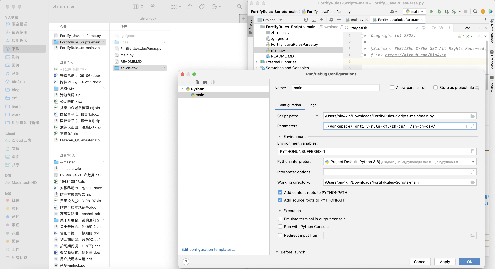
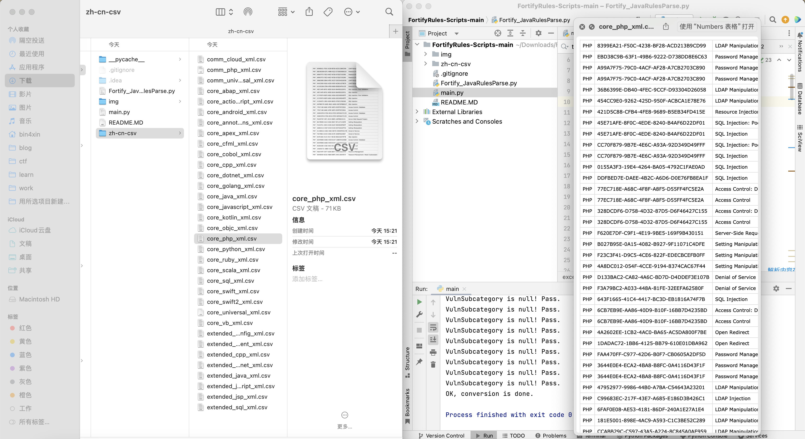

# Fortify Parser Scripts for XML rules

## FPX-Scripts

* Scripts help you `<xml to csv>` after `<bin to xml>`
* 脚本可帮助您在`<bin to xml>`之后`<xml to csv>`

### 这是什么？

用来处理`Fortify XML`规则的工具，它们能够在执行二进制到XML转换后，帮助你将XML数据转换成CSV格式。主要功能包括：

* XML数据解析：这些脚本可以解析XML文件，将其转换成易于处理的数据结构，以便后续的操作。
* 二进制到XML转换：在执行XML规则之前，通常需要从二进制数据中提取XML信息。这些脚本可以帮助你将二进制数据转换成XML格式，以便后续处理。
* XML规则应用：这些脚本可以根据你定义的XML规则来处理XML数据。规则可以包括筛选、转换和映射操作，以满足特定需求。
* CSV输出：最终，这些脚本将处理后的XML数据转换成CSV格式，以便进一步的分析、报告生成或与其他系统的集成。

这些脚本的目的是简化复杂的数据处理流程，特别是在需要处理大量XML数据并将其转换成CSV格式时。

### What's this?

These scripts are tools designed to work with `Fortify XML` rules, allowing you to perform `<xml to csv>` transformations 
after performing a `<bin to xml>` conversion. 

Key Functions:

* XML Data Parsing: These scripts can parse XML files, converting them into data structures that are easier to work with for subsequent operations.
* Binary to XML Conversion: Before applying XML rules, it's often necessary to extract XML information from binary data. These scripts can help you convert binary data into XML format for further processing.
* Application of XML Rules: These scripts can process XML data based on the XML rules you define. Rules can include filtering, transformation, and mapping operations to meet specific requirements.
* CSV Output: Ultimately, these scripts transform processed XML data into CSV format, facilitating further analysis, report generation, or integration with other systems.

The purpose of these scripts is to streamline complex data processing workflows, especially when dealing with large 
volumes of XML data that need to be converted into CSV format.


## Usage

```bash
python3 main.py <xml rule fileDir> <target fileDir write into>
```

### **Attention**

* **你需要准备的：**
  * Fortify规则文件，以`xml`结尾
  * FortifyRules-Scripts

* **What you need to prepare:**
  * Fortify vuln rule files, Looks like some xml files.
  * FortifyRules-Scripts

---

* before run



* after run



供参考[Fortify规则库读取解析语言 |规则ID |漏洞类型 |CSV |Excel |白盒审计](https://www.bilibili.com/video/BV1Wy4y1Q77g/)

## columns

* Lang
* rule ID
* Vulnerable Category

## Enjoy ;)